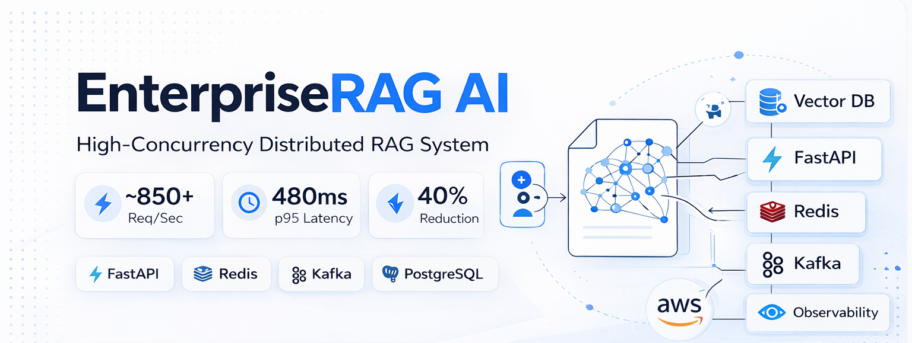

<p align="center">
  
</p>

<p align="center">
  <b>High-concurrency distributed RAG system handling ~850 req/sec with sub-500ms latency.</b>
</p>

<p align="center">
  850+ req/sec • 480ms p95 • 40% latency reduction
</p>

<p align="center">
  FastAPI • Redis • Kafka • PostgreSQL • AWS • Observability
</p>

<p align="center">
  <a href="https://enterpriserag-ai.vercel.app/">
    
  </a>

</p>

---

A production-oriented, multi-tenant backend system for large-scale document intelligence using Retrieval-Augmented Generation (RAG). Designed for high concurrency, low latency, and predictable behavior under load.

---

## Highlights

* High-throughput system handling ~850 req/sec  
* Sub-500ms latency under sustained load  
* ~40% latency optimization through system design  
* Fault-tolerant architecture with <1% error rate  
* Multi-tenant SaaS-ready backend design  

---

## Table of Contents

* Overview
* Problem
* Approach
* Architecture
* Core Components
* Performance & Load Testing
* Engineering Highlights
* Tech Stack
* Deployment
* API Overview
* Design Decisions
* Future Work
* What This Demonstrates

---

## Overview

EnterpriseRAG AI is a distributed, multi-tenant backend designed to process and query large document corpora using semantic retrieval and LLM-based generation. The system prioritizes correctness, latency, and reliability in real-world workloads.

---

## Problem

Traditional document systems break at scale due to:

* Keyword-based retrieval (poor semantic understanding)
* Hallucinated responses without grounding
* High latency under concurrent traffic
* Lack of tenant isolation in SaaS scenarios

---

## Approach

The system combines:

* Vector-based semantic retrieval (FAISS)
* Retrieval-Augmented Generation (RAG)
* Async API layer for concurrency
* Tenant-aware data isolation

This enables context-aware responses with stable performance under load.

---

## Architecture

```text
Client
  ↓
CDN / Edge
  ↓
Load Balancer
  ↓
FastAPI (Async API Layer)
  ↓
Redis (Caching - planned)
  ↓
FAISS (Vector Retrieval)
  ↓
LLM (Response Generation)
  ↓
PostgreSQL (Metadata / Tenancy)
```

---

##  Query Execution Flow

1. Documents are ingested and chunked  
2. Embeddings are generated and stored in FAISS  
3. User query is embedded  
4. Top-K relevant chunks retrieved  
5. Context passed to LLM for grounded response  

## Core Components

### API Layer

* Async FastAPI services (non-blocking)
* Stateless design for horizontal scaling

### Retrieval System

* Document chunking
* Embedding generation (transformers)
* Top-K semantic retrieval via FAISS

### Generation Layer

* Context injection into LLM
* Grounded response generation

### Data Layer

* PostgreSQL for relational metadata and tenancy
* FAISS for vector indexing

---

## Performance & Load Testing

* Tool: k6
* Duration: 10 minutes sustained traffic

| Metric      | Value        |
| ----------- | ------------ |
| Throughput  | ~850 req/sec |
| p95 Latency | ~480 ms      |
| p99 Latency | ~720 ms      |
| Error Rate  | <1%          |

Results show stable performance under high concurrency.

---

## Engineering Highlights

| Area            | Implementation                          |
| --------------- | --------------------------------------- |
| Concurrency     | Async request handling (FastAPI)        |
| Scalability     | Stateless services + horizontal scaling |
| Latency         | ~40% reduction via optimized flow       |
| Fault Tolerance | Retries, timeouts, circuit breakers     |
| Traffic Control | Rate limiting + backpressure            |
| Reliability     | Stable under traffic spikes             |

---

## Tech Stack

### Backend

* FastAPI
* PostgreSQL
* SQLAlchemy
* FAISS

### AI Layer

* Sentence Transformers
* LLM APIs

### Frontend

* React
* TypeScript

### Infrastructure

* AWS (EC2, S3, IAM — production-style deployment)
* Railway (current hosting)
* Vercel (frontend)
* Docker (containerization-ready)

---

## Deployment

* Backend deployed on cloud infrastructure (AWS EC2 / Railway)
* Frontend hosted on Vercel
* Designed for container-based deployment (Docker)

---

## API Overview

### Upload Document

* Stores and processes documents

### Query Endpoint

* Accepts user query
* Retrieves top-K relevant chunks
* Generates grounded response

### Auth

* JWT-based authentication
* Tenant-scoped access

---

## Design Decisions

* Async-first architecture → maximize throughput
* Stateless services → enable horizontal scaling
* Decoupled components → maintainability and extensibility
* RAG over pure LLM → improved correctness and reduced hallucination

---

## Trade-offs

- Vector search improves semantic accuracy but adds memory overhead  
- Async architecture improves throughput but increases debugging complexity  
- Multi-tenant isolation improves security but adds schema and query overhead
  

## Future Work

* Redis caching layer
* Observability (metrics, logs, tracing)
* Hybrid search (keyword + vector)
* Streaming responses (WebSockets)
* Kubernetes-based deployment

---

## What This Demonstrates

* Real-world distributed systems design
* High-concurrency backend engineering
* Low-latency system optimization
* Trade-off awareness (latency vs cost vs accuracy)

---

## Author

Devesh Chauhan
Backend Systems Engineer — Distributed Systems — AI Infrastructure
