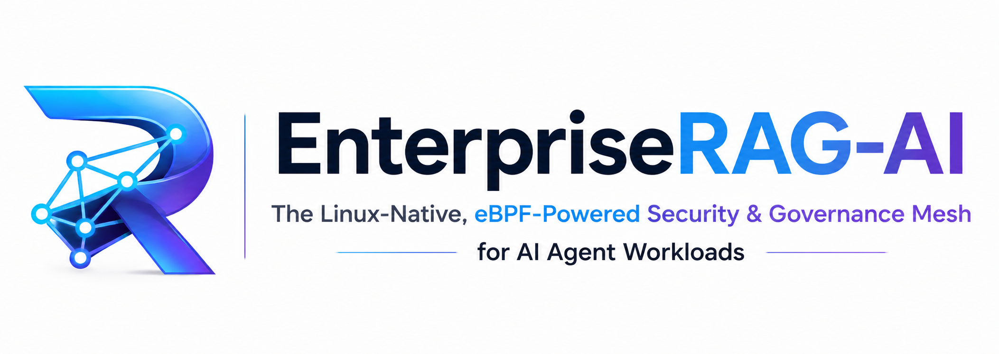

<p align="center">
  
</p>

<p align="center">
  The Linux-Native, eBPF-Powered Security & Governance Mesh for AI Agent Workloads
</p>

<div align="center">

[](LICENSE)
[](https://github.com/devloperdevesh/EnterpriseRAG-AI/stargazers)
[](https://github.com/devloperdevesh/EnterpriseRAG-AI/network/members)
[](https://github.com/devloperdevesh/EnterpriseRAG-AI/graphs/contributors)

</div>

---

# Overview

EnterpriseRAG-AI is an open-source AI infrastructure platform designed to make enterprise AI workloads secure, observable, and reliable.

Modern AI applications require more than powerful language models. Production AI systems need reliable retrieval, secure data boundaries, complete execution visibility, and infrastructure-level reliability.

EnterpriseRAG-AI provides an infrastructure layer for building and operating production-grade Retrieval-Augmented Generation systems and AI agent workloads.

The platform combines:

- Retrieval infrastructure
- Enterprise security controls
- Distributed observability
- AI execution diagnostics
- Reliability engineering workflows

into a unified AI operations platform.

---

# Why EnterpriseRAG-AI?

Building reliable AI systems introduces several engineering challenges.

## Retrieval Reliability

Traditional retrieval systems based only on semantic similarity can struggle with:

- Technical identifiers
- Exact keyword matching
- Enterprise terminology
- Structured information
- Compliance-heavy documents

EnterpriseRAG-AI focuses on improving retrieval quality through intelligent retrieval workflows, ranking strategies, metadata-aware processing, and contextual analysis.

---

## AI System Observability

Modern AI workloads are difficult to debug without complete execution visibility.

Teams need to understand:

- Which documents were retrieved
- How context was constructed
- Where latency was introduced
- How models executed requests
- Why failures occurred

EnterpriseRAG-AI introduces observability across the complete AI request lifecycle.

---

## Enterprise Security & Governance

Enterprise AI systems require strong security boundaries.

EnterpriseRAG-AI focuses on:

- Tenant-aware access control
- Authentication workflows
- Secure document retrieval
- Audit visibility
- Policy-driven AI operations

---


Future:
eBPF Kernel Telemetry Layer

# Core Capabilities

## Retrieval Infrastructure

EnterpriseRAG-AI focuses on building reliable retrieval workflows for enterprise AI applications.

Capabilities include:

- Semantic vector retrieval
- Hybrid retrieval workflows
- Document processing pipelines
- Context optimization
- Retrieval diagnostics
- Query analysis
- Metadata-aware retrieval
- Retrieval performance monitoring


---

## AI Observability

Production AI systems require complete visibility across execution workflows.

EnterpriseRAG-AI provides observability capabilities across:

- Request lifecycle tracking
- Retrieval execution stages
- LLM execution flow
- Token usage monitoring
- Latency analysis
- Distributed tracing
- Infrastructure telemetry


---

## Security & Governance Layer

Enterprise AI workloads require secure boundaries around data and execution.

The platform provides foundations for:

- Authentication and authorization
- Role-based access control
- Tenant-aware data isolation
- Audit logging
- Secure retrieval workflows
- Policy-driven AI operations


---

## Reliability Engineering

EnterpriseRAG-AI explores reliability patterns required for production AI infrastructure.

Engineering areas include:

- Async execution workflows
- Background processing systems
- Error handling mechanisms
- Retry strategies
- Failure diagnostics
- Infrastructure health monitoring


---

# Enterprise Control Center

EnterpriseRAG-AI includes a unified operational dashboard designed for AI infrastructure management.

The control center provides a single interface to understand, monitor, and debug AI workloads.

## Dashboard Modules

### System Overview

Provides visibility into:

- Service health
- Active workloads
- Request activity
- Infrastructure status
- System performance


### Retrieval Intelligence

Provides insights into:

- Retrieval latency
- Retrieved documents
- Context quality
- Ranking information
- Query execution flow


### Observability Center

Tracks:

- Distributed traces
- Request spans
- Backend execution stages
- Latency bottlenecks
- Infrastructure events


### Security Operations

Provides:

- Security events
- Audit history
- Access monitoring
- Tenant activity
- Governance visibility


### Infrastructure Monitoring

Visualizes:

- Service dependencies
- Worker status
- Database health
- Cache activity
- Infrastructure topology


### Analytics

Future analytics modules include:

- Token usage analysis
- AI workload cost insights
- Performance trends
- Usage patterns


---

# Infrastructure Visualization Roadmap

EnterpriseRAG-AI is designed around infrastructure-level visibility.

Planned visualization systems:

## Infrastructure Topology Canvas

Interactive visualization of:

- API Gateway
- Security Layer
- Retrieval Engine
- Vector Database
- Cache Layer
- LLM Gateway
- Workers
- Observability Components


## Retrieval Debug Inspector

A workspace for understanding:

- Query execution
- Retrieved chunks
- Ranking decisions
- Context assembly
- Retrieval quality


## Distributed Trace Explorer

A debugging interface for:

- Request traces
- Execution spans
- Latency breakdowns
- Service dependencies


## Token & Cost Analytics

Monitoring for:

- Token consumption
- Request costs
- Usage trends
- Optimization opportunities


---

# Technology Stack

## Backend Infrastructure

- FastAPI
- Python
- PostgreSQL
- Redis
- FAISS
- Celery


## Frontend Infrastructure

- React
- TypeScript
- Tailwind CSS
- Recharts
- React Flow


## Observability Stack

- OpenTelemetry
- Jaeger
- Prometheus
- Grafana


## Infrastructure

- Docker
- NGINX
- Kubernetes
- Vercel


---

# Engineering Roadmap

| Area | Status |
|------|--------|
| RAG Pipeline | Active |
| Retrieval Optimization | Active |
| Security Controls | Active |
| Observability Layer | Active |
| Enterprise Dashboard | In Progress |
| Retrieval Debugging Tools | In Progress |
| Distributed Trace Explorer | In Progress |
| Infrastructure Topology | In Progress |
| Token Usage Analytics | Planned |
| AI Agent Monitoring | Planned |
| eBPF Kernel Telemetry | Research |
| Advanced Governance Layer | Planned |

---
---

# Repository Architecture

EnterpriseRAG-AI follows a modular architecture designed for scalability, maintainability, and enterprise deployment.

EnterpriseRAG-AI
│
├── frontend/
│   ├── components/
│   ├── dashboard/
│   ├── pages/
│   └── services/
│
├── backend/
│   ├── app/
│   │   ├── api/
│   │   ├── core/
│   │   ├── models/
│   │   ├── rag/
│   │   ├── services/
│   │   └── workers/
│
├── infrastructure/
│   ├── docker/
│   ├── kubernetes/
│   ├── monitoring/
│   └── deployment/
│
├── docs/
│
├── tests/
│
└── README.md

Architecture

# EnterpriseRAG-AI follows a cloud-native AI infrastructure architecture.

```text
                         Users
                           |
                           |
                    API Gateway Layer
                           |
                           |
              Security & Tenant Control
              (RBAC + Metadata Policies)
                           |
                           |
              Retrieval Control Plane
                           |
              -------------------------
              |                       |
        Vector Retrieval          Cache Layer
             FAISS                  Redis
              |
              |
        Context Optimization
        Token Management
        Retrieval Pipeline
              |
              |
             LLM Gateway
              |
              |
       Observability Platform
              |
     ---------------------------
     |            |            |
 OpenTelemetry  Jaeger   Prometheus/Grafana

   ```text

